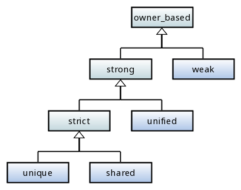

# Теоретическая основа

C++ - мультипарадигменный язык, который позволяет писать программы следуя парадигмам Объектно Ориентированного Программирования, Функционального Программирования и другим. Но не для каждой парадигмы C++ предоставляет достаточный набор инструментов, чтобы в её русле было удобно разрабатывать ПО. В то же время, C++ позволяет разработчикам самим создавать необходимый инструментарий, который расширит возможности языка для комфортного написания кода в выбранной парадигме. Целью проекта UPL является создание инструментальной библиотеки для повышения качества и удобства программирования на языке C++ в стиле ООП, в частности для организации ассоциативных связей между объектами в многопоточной среде.

## Ассоциативные связи

В качестве теоретической основы ассоциативных связей было взято их описание из Unified Modeling Language (UML). На текущий момент используется спецификация [UML 2.5](https://www.omg.org/spec/UML/2.5/About-UML/). Ассоциативные связи описаны в разделе 11.5 Associations. Они определяют семантические отношения, которые могут возникать между объектами. *Полюс ассоциации* (*memberEnd*, см. UML 11.8.1.6 Association Ends) может быть представлен *Свойством* (см. UML 9.5 Properties), *тип агрегации* (см. UML 9.9.1 AggregationKind [Enumeration]) которого выражает семантику агрегации между объектами. *Агрегацией* называется отношение *часть-целое*, при которой один объект используется для группировки в своём составе множества других объектов.

*AggregationKind* определяет три типа *агрегации*:

| AggregationKind | Описание |
|-----------------|----------|
| `none`          | Обозначает, что *Свойство* не имеет семантики агрегации. |
| `shared`        | Обозначает, что *Свойство* имеет семантику совместной агрегации.   Точное определение семантики совместной агрегации зависит от области применения и проектировщика модели. |
| `composite`     | Обозначает, что *Свойство* агрегируется композитно, т.е. *композитный* (составной) объект несет ответственность за существование и хранение своих частей. |

*Композитная* агрегация является сильной формой агрегации, которая требует, чтобы *объект-часть* входил в состав только одного *композитного объекта* одновременно. И, если удаляется *композитный объект*, то все его *объекты-части* удаляются вместе с ним. При этом отмечается, что *объект-часть* может быть выведен из состава *композитного объекта* перед его удалением, и тогда эта *часть* не будет удалена.

Ассоциативные связи UML нельзя однозначно выразить базовыми средствами языка C++. Для этого, можно было бы использовать *ссылки* и *сырые указатели* (raw pointers), но они, как минимум, не могут выразить *композитной агрегации*. Умные указатели стандартной библиотеки C++ обладают подходящей семантикой агрегации: `std::shared_ptr` и `std::weak_ptr` могут выразить `shared` агрегацию, но с помощью `std::unique_ptr` сложно выразить `composite` агрегацию, т.к. для него нет безопасного противоположного *полюса ассоциации* (как `std::weak_ptr` для `std::shared_ptr`) - невладеющей ссылки на объект, который находится в уникальном владении `std::unique_ptr`. В качестве такой "невладеющей ссылки" можно использовать сырой указатель (и его вариации), но в многопоточной среде это небезопасно, т.к. появляется риск образования "висячих указателей" (dangling pointers). Эти ограничения базовых средств C++ подтолкнули к необходимости расширения их возможностей и созданию унифицированных указателей `upl::unique`, `upl::shared` и `upl::weak` в составе библиотеки UPL, которые могли бы в полной мере выражать семантику ассоциативных связей UML.

## Свойства, параметры и переменные

В UML *полюс ассоциации* выражается средствами *Свойства* (см. UML 9.5 Properties), которое, в свою очередь, в C++ может быть представлено как поле класса. Указатели UPL могут использоваться в полях класса для формирования ассоциативных связей между объектами. Для выражения требуемой семантики *агрегации* используется указатель с соответствующим типом [владения](#Владение).

Но объекты участвуют не только в ассоциативных связях. Они ещё могут, например, передаваться в функции для обработки. Передача объекта в функцию осуществляется с помощью её *параметров* (см. UML 9.4.3.4 Parameters). В теле функции, во время её работы, объект может временно храниться в *переменной* (см. UML 15.2.3.5 Variables). При этом должна соблюдаться целостность *агрегации* объектов. Например, если один объект является составной частью другого объекта (находится в уникальном владении, посредством указателя `upl::unique` в его поле), то в теле функции нельзя добавить его в состав третьего объекта, или сформировать ещё одну "сильную" ссылку на него в переменной типа `upl::unique` или `upl::shared`. Более того, *параметры* и *переменные* в UML не обладают семантикой *агрегации*, поэтому идеологически неверно использовать указатели `upl::unique`, `upl::shared` и `upl::weak` для их представления в C++. Но в целях оптимизации и уточнения семантики параметров функции в C++, эти указатели могут использоваться в параметрах и переменных.

Чтобы соблюсти целостность *агрегации* объектов и доступа к ним через параметры и переменные функции, в UPL был добавлен указатель `upl::unified`, с унифицированным (`unified`) типом владения. Он предназначен для возможности создания временной "сильной" ссылки на объект, который уже может находиться во владении другого объекта, как уникальном, так и совместном. При этом, в многопоточной среде, если *объект-владелец* удалится, то функция сможет корректно завершить работу с *объектом-частью*, на который ссылается её параметр или переменная типа `upl::unified`. Таким образом, указатель `upl::unified` может временно продлить время жизни объекта в своей области видимости. Исходя из этого, он мог бы называться `upl::scoped`, но такое имя в типе параметра функции может сбить с толку, поэтому было выбрано более универсальное и нейтральное `upl::unified`.

## Владение

При описании ассоциативных связей в UML используется семантика *агрегации* (`none`, `shared`, `composite`). С другой стороны, в C++ больше оперируют семантикой *владения* (`unique`, `shared`, `weak`). Эти семантики различаются в нюансах, но их основы можно объединить в следующее соответствие:

| AggregationKind     | Тип владения     |
|---------------------|------------------|
| `none`              | `weak`           |
| `shared`            | `shared`         |
| `composite`         | `unique`         |

Типы владения можно сгруппировать и сформировать в иерархию:

* `owner_based` - "базовое" владение. Отображает факт того, что некий "владелец"(указатель) ссылается на объект.
* `strong` - "сильное" владение. Владеющая ссылка на объект. Объект существует, пока есть "сильные" ссылки на него. Антоним `weak`.
* `weak` - "слабое" владение. Невладеющая ссылка на объект. Невладеющие ссылки не влияют на время жизни объекта. Антоним `strong`.
* `unified` - "унифицированное" владение. Владеющая ссылка на объект, который может находиться как в `unique`, так и в `shared` владении. "Унифицированное" владение может продлить время жизни объекта. Антоним `strict`.
* `strict` - "строгое" владение: либо `unique`, либо `shared`. Антоним `unified`.
* `unique` - "уникальное" владение. Владеющая ссылка на объект. Единовременно может существовать только одна "уникальная" ссылка на объект. Антоним `shared`.
* `shared` - "совместное" владение. Владеющая ссылка на объект. Единовременно могут существовать несколько "совместных" ссылок на объект. Антоним `unique`.

Имена указателей `upl::weak`, `upl::unified`, `upl::unique` и `upl::shared` совпадают с типом владения, которым они обладают.

## Кратность

*Кратность* (см. UML 7.5.3.2 Multiplicities) определяет, какое минимальное и максимальное количество *значений* может храниться в *коллекции*. Указатель может ссылаться максимум на один объект (хоть этот объект и может быть массивом/коллекцией, для указателя это одно *значение*). Поэтому, для указателей актуально два варианта кратности: 

* `optional` - "опциональная" [0 .. 1]. Указатель может ссылаться на один объект, либо быть пустым.
* `single` - "одинарная" [1 .. 1]. Указатель обязательно ссылается на один объект, не может быть пустым (см. [примечание для C++](#CppMultiplicityNote)).

По умолчанию, указатели UPL имеют *опциональную* кратность. Для удобства использования, в библиотеку добавлены указатели с явным обозначением кратности в суффиксе:

| По умолчанию |`optional`          | `single`         |
|--------------|--------------------|------------------|
| `weak`       | `weak_optional`    | `weak_single`    |
| `unified`    | `unified_optional` | `unified_single` |
| `unique`     | `unique_optional`  | `unique_single`  |
| `shared`     | `shared_optional`  | `shared_single`  |
\* все указатели находятся в пространстве имён `upl`.

Чтобы увеличить кратность ассоциативной связи, в поле класса можно использовать коллекцию из указателей. Контейнеры стандартной библиотеки C++ обычно имеют кратность [0 .. \*], в качестве их элементов рекомендуется использовать указатели с *одинарной* кратностью. Например, `std::vector<upl::unique_single<T>>`.

**Примечание для C++:** *Одинарная* кратность указывает, что в *коллекции* всегда должно быть одно *значение*. Это позволяет не выполнять проверку на "пустоту" *коллекции* (`nullptr` в случае указателей C++) перед доступом к *значению*, а сразу обращаться к нему. В случае *одинарных* указателей UPL это означает, что они всегда должны ссылаться на валидный объект. Это достигается тем, что в классах *одинарных* указателей удалён конструктор по умолчанию, в конструкторах и операторах присваивания выполняются проверки, исключающие образование "пустого" (`nullptr`) указателя. По возможности, эти проверки выполняются в compile-time, иначе они происходят в run-time, с выбрасыванием исключения в случае нарушения условия, что указатель должен ссылаться на валидный объект. Однако, в C++ есть семантика перемещения (move semantics), и после операции перемещения объект может оказаться в невалидном состоянии. Для *одинарных* указателей UPL перемещение (`std::move()`) - это единственная допустимая операция, после которой указатель не ссылается на валидный объект. К "перемещённым" *одинарным* указателям применяется обычная практика C++: после перемещения объекта не обращаться к нему/удалить его, либо присвоить ему новое значение.
